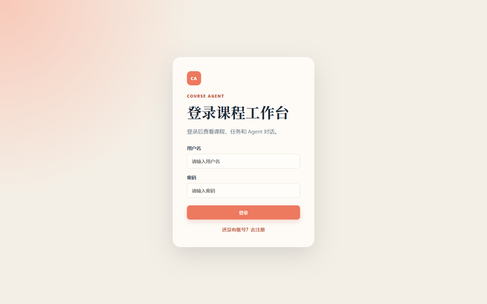
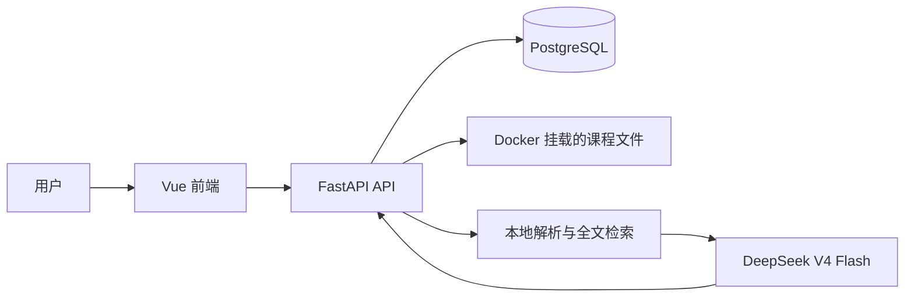

# Course Agent

[](https://github.com/FlowWhite/course-agent/actions/workflows/ci.yml)

Course Agent 是一个面向课程任务执行的学习工作台。它把课程资料、任务截止日期与学习计划结合起来，提供**有来源、可解释、需确认**的学习辅助，而不是直接替用户修改任务。

## 界面展示



## 核心能力

- 课程任务管理：注册、登录、JWT 鉴权、任务增删改查与状态切换。
- 课程资料检索：支持 PDF、DOCX、TXT、Markdown；后端本地解析并按用户、课程隔离保存。
- 资料增强 Agent：仅检索当前课程资料与任务，回答时提供文件名与页码等来源信息。
- 截止日期风险雷达：以确定性规则计算剩余天数、优先级、计划工作量、计划冲突与资料要求的风险。
- 可恢复学习计划：先生成草案，再由用户确认启动；状态可暂停、恢复，并持久化到 PostgreSQL。
- 任务拆解安全边界：所有任务修改仍需要用户确认；上传资料只是参考文本，不能改变 Agent 的工具权限或确认规则。

## 架构



原始 PDF 不会直接发送给模型：后端先提取文本、按页/段分块并保存检索来源；只有与当前问题有关的片段会作为课程参考提供给 Agent。

## 技术栈

- 后端：Python、FastAPI、OpenAI Agents SDK、DeepSeek V4 Flash
- 前端：Vue 3、Vite
- 数据与部署：PostgreSQL、Docker Compose
- 文档解析：pypdf、python-docx

## 项目结构

```text
.
├─ backend/
│  ├─ src/course_agent/
│  │  ├─ main.py                # FastAPI 装配、中间件与生命周期
│  │  ├─ api/
│  │  │  ├─ dependencies.py     # JWT 鉴权等共享依赖
│  │  │  ├─ schemas.py          # HTTP 请求模型
│  │  │  └─ routers/            # 认证、任务、资料、计划、风险与 Agent 路由
│  │  └─ ...                    # Agent、服务、数据库与领域模型
│  └─ tests/                    # 后端与 API 契约测试
├─ server.py / app.py           # 旧启动命令的兼容入口
├─ postgres/                    # PostgreSQL 初始化 SQL
├─ scripts/                     # Docker 启动、迁移与历史维护脚本
│  ├─ migrations/
│  └─ legacy/sqlite/
├─ docs/images/                 # README 展示图片
└─ web/                         # Vue 3 前端
   ├─ src/components/           # 认证、课程侧栏、任务列表与详情等视觉组件
   └─ src/composables/          # 课程工作台状态、API 调用与交互逻辑
```

## 本地启动

### 1. 配置环境变量

复制示例文件并填写本机的真实配置：

```powershell
Copy-Item .env.example .env
```

至少设置 `DEEPSEEK_API_KEY`、`POSTGRES_PASSWORD` 和 `JWT_SECRET_KEY`。`.env` 已被 Git 忽略，不能提交到仓库。

本地直接运行后端时，先以 editable mode 安装包：

```powershell
.\.venv\Scripts\python.exe -m pip install -e .
```

### 2. 启动服务

```powershell
docker compose up --build
```

启动后访问：

- 前端：<http://127.0.0.1:5173>
- 后端健康检查：<http://127.0.0.1:8000/health>

## 开发验证

后端基础测试不需要真实数据库、课程文件或模型密钥：

```powershell
.\.venv\Scripts\python.exe -m unittest discover -s backend/tests -v
.\.venv\Scripts\python.exe -m compileall -q backend/src
```

前端构建验证：

```powershell
Set-Location web
npm.cmd ci
npm.cmd run build
```

## GitHub 发布安全清单

提交前务必检查暂存区：

```powershell
git status --short
git check-ignore -v .env data/sessions.db logs/agent.log .playwright-mcp
git diff --cached --name-only
```

可以提交源代码、`postgres/init.sql`、Docker 配置、启动脚本、`.env.example`、测试、CI 和本文档。禁止提交真实 `.env`、上传的课程资料、运行数据库、会话库、日志或浏览器自动化状态。

建议首次创建 **Private** GitHub 仓库，确认没有敏感内容后再决定是否公开。公开展示时应使用脱敏课程资料和演示账号。

## 当前边界与路线图

当前版本刻意不引入向量数据库、OCR、LangGraph、多 Agent、MCP 或自动修改任务的工作流。

下一阶段重点：

1. 保存每日可用学习时间并生成按天排程；
2. 根据课程资料提供作业验收清单；
3. 在现有 CI 基础上补充 PostgreSQL 集成测试；
4. 最后再评估日历提醒、课程偏好记忆与小组协作。

## 许可证

尚未指定开源许可证。在公开仓库前，请先明确是否允许复用、修改和再分发。
